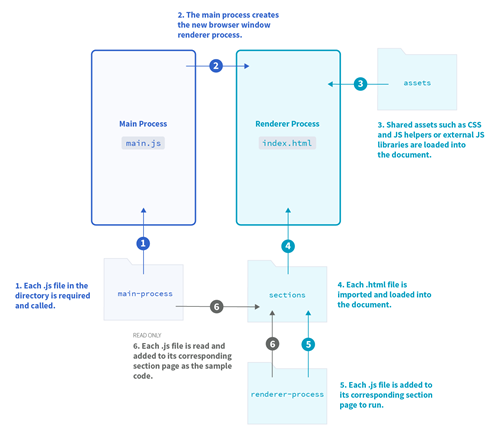

## OID标识管理系统(EMPI-Demo)

## 需求分析

### 系统概述

本系统是OID标识管理系统(Demo)，可供使用的功能主要包括：通过编号或二维码查询、添加、修改和删除OID标识、一键查询所有或部分标识。
OID标识是唯一的，其生成规则在参考北京大学人民医院患者EMPI标识的基础上，加入了性别信息，户籍信息和年龄信息，且加入随机码进行隐私保护。
在编号的相关功能中，均可以PDF格式打印导出整个页面，以便更加灵活的使用二维码的相关功能。

### 功能需求

本系统是第四届“共享杯”大学生科技资源共享服务创新大赛的参赛作品，题目为[《基于物联网OID标识的研究推广工具》](http://share.escience.gov.cn/index/competitiontopic_topicDetail.action?topicId=303)，
题目要求实现以下功能：

> 1. 产生标准位数的OID码
> 2. 可以设置OID码对应的内容
> 3. 实现通过扫描查找OID码的内容

因此根据需求，系统主要实现以下一些基本功能：

- [x] 通过编号查询OID标识功能：在文本框输入OID标识对应的编号，点击“确定”按钮，结果栏将显示找到的被标识的对象及其附加信息，并生成二维码
- [x] 通过二维码查询OID标识功能：将摄像头对准打印出来的二维码，点击“确定”按钮进行拍照，结果栏将显示找到的被标识的对象及其附加信息
- [x] 通过编号添加OID标识功能：在文本框填写患者信息的相应内容，点击“确定”按钮，结果栏将显示新增的被标识的对象及其附加信息，并生成二维码
- [x] 通过二维码添加OID标识功能：将摄像头对准打印出来的二维码，点击“确定”按钮进行拍照，结果栏将显示新增的被标识的对象及其附加信息
- [x] 通过编号修改OID标识功能：在文本框输入OID标识对应的编号，填写患者信息的相应内容，点击“确定”按钮，结果栏将显示变化的被标识的对象及其附加信息，并生成二维码
- [x] 通过二维码修改OID标识功能：将摄像头对准打印出来的二维码，点击“确定”按钮进行拍照，结果栏将显示变化的被标识的对象及其附加信息
- [x] 通过编号删除OID标识功能：在文本框输入OID标识对应的编号，点击“确定”按钮，结果栏将显示去掉的被标识的对象及其附加信息，并生成二维码
- [x] 通过二维码删除OID标识功能：将摄像头对准打印出来的二维码，点击“确定”按钮进行拍照，结果栏将显示去掉的被标识的对象及其附加信息
- [x] 一键查询全部OID标识功能：点击“确定”按钮，结果栏将显示全部被标识的对象及其附加信息
- [x] 一键查询部分OID标识功能：在下拉框选择查询范围，点击“确定”按钮，结果栏将显示范围内的部分被标识的对象及其附加信息
- [x] 一键打印页面功能：点击“打印”按钮，即可以PDF格式打印导出整个页面

## 总体设计

### 设计思路

OID标识管理系统(Demo)是一个推广物联网OID标识的工具，因此界面设计应简洁友好，功能实现易用且人性化，同时程序应能打包，体积尽量小。
Electron(Atom-Shell)是GitHub随Atom一起开源的跨平台利用Web技术(HTML+CSS+JavaScript+Node.js)开发桌面应用的开源框架，Atom即构建在Electron之上。

### 模块结构



根据需求分析结果，系统大体上可以分为六个模块：`assets`、`main-process`、`renderer-process`、`sections`、`index.html`和`main.js`。

* `assets`：系统样式，包含主页面和功能界面UI美化所需的的.css文件及字体、图片等文件
* `main-process`：系统功能页面主进程，包含基本的数据增查改删功能，可与功能页面渲染进程通信
* `renderer-process`：系统功能页面渲染进程，包含页面中元素所绑定的事件，可与功能页面主进程通信
* `sections`：系统功能页面，包含按钮、文本框、视频框等元素，将renderer-process下的.js脚本文件载入并绑定
* `index.html`：系统主界面，包含一个导航栏和一个页面栏，页面栏将sections下的.html页面文件载入并显示
* `main.js`：系统主进程，包含程序生命周期指令，将main-process下的.js脚本文件载入并执行

## 运行方法

项目采用Node.js+Electron进行开发，在已安装Node.js与Git的情况下，本地运行及测试方法如下：

Electron Prebuilt是一个`npm`模块，包含所使用的Electron预编译版本，按照如下方式全局安装：

```
npm install electron-prebuilt -g
```

下载项目的源代码：

```
git clone https://github.com/viper404/share-oid.git
```

进入项目目录：

```
cd share-oid
cd qrcode
```

安装依赖：

```
npm install
```

运行：

```
electron .
```
